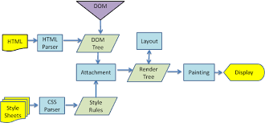

# The Evolution of React 
---

## Topics to Cover:
- [The Evolution of the Web: Tracing the history and development of web technologies.](#the-evolution-of-the-web-tracing-the-history-and-development-of-web-technologies-bombbomb)
- [The Rendering Process in the Past: Exploring how web documents were displayed in earlier times.](#the-rendering-process-in-the-past-exploring-how-web-documents-were-displayed-in-earlier-timeseyeseyes)
- [Problem-Solving with React: Understanding the issues that React addresses in web development.](#problem-solving-with-react-understanding-the-issues-that-react-addresses-in-web-development-game_diegame_die)
- [Benefits of Framework Utilization: Exploring the advantages of using a framework in web development.](#benefits-of-framework-utilization-exploring-the-advantages-of-using-a-framework-in-web-development-zapzap)
- [Framework vs. Library: Distinguishing between a framework and a library and their respective roles.](#framework-vs-library-distinguishing-between-a-framework-and-a-library-and-their-respective-roles-vsvs)
- [Understanding React's Inner Workings: Delving into the working principles of React](#understanding-reacts-inner-workings-delving-into-the-working-principles-of-react-anchoranchor)
- [Client-Side vs. Server-Side: Differentiating between client-side and server-side in web applications](#client-side-vs-server-side-differentiating-between-client-side-and-server-side-in-web-applications-computerbust_in_silhouette)
- [Advantages of Client-Side Development: Exploring the reasons for using client-side technologies.](#advantages-of-client-side-development-exploring-the-reasons-for-using-client-side-technologiesstarstar)
- [Advantages of Server-Side Development: Understanding the benefits of server-side technologies.](#advantages-of-server-side-development-understanding-the-benefits-of-server-side-technologiesstar2star2)
- [React's Rendering Mechanism: Explaining the concept of rendering in React.](#reacts-rendering-mechanism-explaining-the-concept-of-rendering-in-reactangeranger)
- [The Document Object Model (DOM): Defining the DOM and its significance in web development.](#the-document-object-model-dom-defining-the-dom-and-its-significance-in-web-developmentdizzydizzy)
- [The Virtual DOM: Understanding the concept of the virtual DOM in React.](#the-virtual-dom-understanding-the-concept-of-the-virtual-dom-in-reactrobotrobot)
- [Pros and Cons of the Virtual DOM: Evaluating the advantages and disadvantages of the virtual DOM.](#pros-and-cons-of-the-virtual-dom-evaluating-the-advantages-and-disadvantages-of-the-virtual-dom-hourglass_flowing_sandhourglass_flowing_sand)
- [Enhancing the Virtual DOM: Investigating potential improvements to the virtual DOM based on research and perspectives.](#enhancing-the-virtual-dom-investigating-potential-improvements-to-the-virtual-dom-based-on-research-and-perspectives)
- [React vs. jQuery: Highlighting the differences between React and jQuery.](#react-vs-jquery-highlighting-the-differences-between-react-and-jquerytadatada)
- [RESOURCES](#resources)
---
## The Evolution of the Web: Tracing the history and development of web technologies .:bomb::bomb:
so before knowing the evolution of the web , I think it'll be more logical to start with just a breif of the web itself .
* What is the Web 🤔❓  well, the web is a common name for the world wide web , and just to be in the loop the web is not the same as the internet ,Rather the web is a subset of the Internet refers to all the public websites or pages that users can access on their local computers and other devices through the internet.
  

* Web Evolution ❗❗ or what i like to call **Web Generations** 
 [ Web 1 , Web 2 , Web 3 ]

* Web 1 : Read-only </u>
it mainly started with a British computer scientist Tim Berner Lee who wrote the first web page editor/browser (“WorldWideWeb.app”), where web 1 technologies included basic HTML, HTTP, and URI protocols.that provide a limited or static user experience (basic websites)

* Then there was Web 2 : Read and Write (new Internet generation)
Web 2 sites allowed for the gathering and management of global groups with common interests, and the medium offered social interaction.(the rise of commerce on the internet)

* Web 3 – Internet of today
Web 3.0 is the third generation of web services for websites and applications that focuses on using machine understanding of data to provide a data-driven and semantic web. The ultimate goal of Web 3.0 is to create more intelligent, connected, and open websites.(the executable web or read- write-execute web)
   
  
## The Rendering Process in the Past: Exploring how web documents were displayed in earlier times.:eyes::eyes:
come to think what is the meaning of Rendering in the programming world❓❕
 
Rendering is a process used in web development that turns website code into the interactive pages users see when they visit a website . The term generally refers to the use of HTML, CSS, and JavaScript codes.The process is completed by a rendering engine, the software used by a web browser to render a web page , thus we need to look into **the history of the web browsers**.
- well , at the very beginning web browsers such as lynx were texted-based browsers that couldn’t display any graphic content  ( They didn't support images, styles, or other media elements ).

- As the web evolved, HTML (Hypertext Markup Language) tags were introduced to structure content such as Mosaic : the first browser to allow images embedded in text making it “the world’s first most popular browser”

- Then Netscape Navigator quickly dominated the web browser market, surpassing Mosaic.It introduced many innovative features that are now standard in modern web browsers, such as JavaScript, frames, and cookies
- “browser war” between companies started --- first Internet Explorer enjoyed success then other web browsers, such as Opera and Apple’s Safari, sought to challenge IE’s dominance, but One of the most significant competitors to IE emerged in 2004: Mozilla’s Firefox. Firefox took on Internet Explorer by providing better security features and a more customizable interface
- Eventually, Google released the Chrome web browser in 2008. Chrome quickly gained momentum due to its simplistic interface, fast loading times, and seamless integration with other Google services.

Now , away from the history of web browsers and how web documents were displayed in earlier times , let's cut to the chase and start wondering **how rendering works❔ or what is Rendering Process❔**.
 

 
to get to that there are two concepts we should understand 
  #### DOM and CSSOM 

The server delivers a piece of HTML code that is parsed by the browser and a tree is generated. This tree is called DOM. Moreover the browser also receives CSS instructions which are parsed and this generates another tree called CSSOM
we then combine DOand CSSOM into render tree, one of the properties of render tree that it only captures visible content,Once the render tree is complete, the browser can execute the process of reflow and repaint
   

## Problem-Solving with React: Understanding the issues that React addresses in web development. :game_die::game_die:
Did you know that React.js is used by over 17 million websites worldwide, including major players like Facebook, Instagram, and Airbnb? It is the most used web frameworks worldwide. Today, React.js is used by many Fortune 500 companies. Facebook has full-time React development staff. They regularly release bug fixes, enhancements, blog posts, and documentation.
 
#### The Problems React Solves OR in other words Why React ?
 
- The main problem solved by react is the development of large applications that have temporal data changes. The data in such applications is not static so it changes over time. We can look at React as the V layer in model-view-controller (MVC) pattern of software development.
- In React, components are the building blocks of the UI. Each component can manage its own state and props (properties received from parent components), and when the state or props change, React efficiently updates the affected parts of the UI.
- in conclusion, react is Component-Based Architecture,provides Efficient Updates
- It offers fast rendering.
-
   

## Benefits of Framework Utilization: Exploring the advantages of using a framework in web development. :zap::zap:
***What is a web framework ?***
 
A web framework is a software development tool that simplifies the process of building and running web applications and web services. It’s, more specifically, a set of pre-written code libraries and modules that programmers can use to build web applications much faster.
 
Web frameworks typically support one or more programming languages to facilitate faster development with fewer coding complexities.
  
***Benefits of Framework Utilization***?
- Easy Debugging Process
- Security: Frameworks come with built-in security features that protect against common web vulnerabilities such as cross-site scripting (XSS) and SQL injection
- Improved Code Efficiency : as Web frameworks have their main focus on improving code readability and reusability, thereby providing the fastest and most efficient way to develop self-sustaining web applications
- Reduces Code Length
- Improves Database Proficiency (such as laravel ): Web frameworks often include built-in tools for database integration, making it easier to work with databases. This can help improve database proficiency, which is essential for web applications that rely on data . 
   
## Framework vs. Library: Distinguishing between a framework and a library and their respective roles. :vs::vs:

 
Although both frameworks and libraries are tools used in software development, they differ significantly from one another.when you develop a software application, you will need many libraries, but often one or two frameworks.AS libraries target a specific functionality, while a framework tries to provide everything required to develop a complete application
   
## Understanding React's Inner Workings: Delving into the working principles of React. :anchor::anchor:
First of all , let's just clear something ,React is a JavaScript library that creates user interfaces (UI) in an efficient way ,and react is not a framework.
#### A Quik Intro of what's React
- React is an open source code meaning that you can read its source code and even try to contribute to it and cause code always changes not just every year but also every week so the goal was never to understand every line of react but to get a sense, an overall picture of how it's accomplishing and what it's accomplishing
- For more understanding let's not consider react as some kind of utility
but rather we may consider it as other people's javascript code. ( js library )
#### React Concepts
- In react it's very common to build out a single page application ,so before diving into react's concepts , let's recap single page application...normally, we have a template for each page on our website and we call or return that templete wheneve it's requested, However in single page application we only have one templete and we're simply updating all the components within the DOM, it's like you're including other pages in one template instead of having a template for each one
- Components : are the main building block of react. Components are what make up the visual layer of our apllication and let us split up our UI into an independent reusable pieces , knowing that components can be nested as deep as you want , a component can hold another component can hold more components
- JSX : (javascript XML) is simply a syntactic sugar for creating very specific JavaScript objects. Its a JavaScript extension.it's simply a html code but with slight syntax differences just as we're writing js in html tags but with more simple syntax , but when using jsx keep in mind that browsers don’t understand JSX, so we need to run it through a compiler first.
- URL Routing : using a react router is how we can have multiple pages in a single page application with react we typically handle URL routing with something called a router that keeps our ui in sync witha url, as the router will take care of rendering out components into the dom based on the url provided
- Props : Sometimes it is required to pass data from one component to another. This can be done using props.
- State : is simply a js object used to represent information in or about particular component, When a state is changed in a react component the DOM is re-rendered to save the changes made.
- Component LifeCycle : there are 3 phases we need to know in this cycle , each component has a **mounting phase** for when it's first being added to the DOM , an **updating phase** for when we are modifying and updating something in that component, and finally an **unmounting phase** for when this component will die or be removed from the dom.
- Hooks : Hooks are basically a JavaScript function that does certain things. Hooks in react has made the use of functional component more reliable , hooks let us add state and other features without using class based components
- Conditional Rendering : Its possible that the developer would want to show some data to the user on a certain condition. If the condition is fulfilled then the user can see the data or they might not see.
   
## Client-Side vs. Server-Side: Differentiating between client-side and server-side in web applications. :computer::bust_in_silhouette:
server-side and client-side refer to the location where certain tasks or processes are carried out in a web application. Server-side processes are executed on the web server, while client-side processes are executed on the user's device. These processes have different levels of access to resources and trust, and they play different roles in the overall functioning of a web application
#### client side
- Client-side
- Does not need interaction with the server
- Runs on the user’s computer
- Reduces load on the server’s 
#### server side 
- Requires interaction with the server
- Runs on the web server
- Allows the server to provide dynamic websites tailored to the user. Increases the processing load on server.
   
## Advantages of Client-Side Development: Exploring the reasons for using client-side technologies.:star::star:
- Faster and more responsive websites
- It allows for more interactivity. It usually performs several actions without going to the user.
- Pages are altered on basis of the user’s choice. It can also be used to create “cookies” that store data on the user’s computer.
- Cross-platform compatibility – Client-side scripting can be used with multiple platforms such as Windows, Mac, and Linux without any compatibility issues.
- Reduced server load – Because client-side scripting reduces the need for server communication, it can help reduce server load and improve overall website performance.
   
## Advantages of Server-Side Development: Understanding the benefits of server-side technologies.:star2::star2:
- Allows for better security, reliability & scalability
- Faster load time. A server-side rendered application speeds up page loading when the user suffers from a slow internet connection. Thus it greatly improves the whole user experience.
- Easy indexation by search engines. As the content can be rendered before the page is loaded when rendering server-side, search engines can easily index and crawl it.
- data processing is performed completely on the server side instead of client side, and raw data is never transferred across the internet.
   
## React's Rendering Mechanism: Explaining the concept of rendering in React.:anger::anger:
before starting i recommend reading 
[Understanding React's Inner Workings: Delving into the working principles of React](#understanding-reacts-inner-workings-delving-into-the-working-principles-of-react-anchoranchor)
 this part.
  
Before React components can be displayed on the screen, they must first be rendered by React.
 
when we run a react application , the code written in the components gets translated into elements that get mounted onto the dom, the react documentation splits this work into two phases : the render phase and the commit phase. 
#### With respect of the initial rendering
- The Render Phase : The render phase is the initial phase of the rendering process. In this phase, the JSX code is converted to a JavaScript representation of what the HTML structure should look like.once this conversion is done for the entire component tree , all the react elements are handed over to the commit phase
- The Commit Phase : the react elements are applied to the dom using the react dom package 
#### With respect to re-render (as in react components need to re-render in order to update the ui) 
- The Render Phase : same as the initial render but this time react will continue finding all the components that have been flaged as needing updates ,and for each of the flagged components react will do the conversion ( from jsx into react elements ) and once it done , react will compare the new set of react elements with the ones produced  from the last render then a list is created with all the changes that need to be made to the dom and handed over to the commit phase 
- The commit phase : in this phase the changed are applied to the dom

   
## The Document Object Model (DOM): Defining the DOM and its significance in web development.:dizzy::dizzy:
The Document Object Model (DOM) is a programming API for HTML and XML documents. It defines the logical structure of documents and the way a document is accessed and manipulated. it provides the ability to analyze and change the document being presented to the user , once you pass a HTML to a browser what you're dealing with is actually the DOM
 
It is called a Logical structure because DOM doesn’t specify any relationship between objects. 
- Why DOM is required?
When an HTML file is loaded into the browser, the javascript can not understand the HTML document directly. So, a corresponding document is created(DOM). DOM is basically the representation of the same HTML document but in a different format with the use of objects.
   
## The Virtual DOM: Understanding the concept of the virtual DOM in React.:robot::robot:
#### How virtual DOM works ❓
 
well, in short, reacet creates something called a virtual dom which is a virtual representation of the real dom. When we're updating our components we actually updating the virtual dom and not the real one , using this method react can find the most efficient way to update the real dom by updating only areas where changes have made without having to update the entire dom.
 
In Conclusion : The Virtual DOM is a powerful concept in React.js that revolutionizes the way web applications are rendered and updated.
   

## Pros and Cons of the Virtual DOM: Evaluating the advantages and disadvantages of the virtual DOM. :hourglass_flowing_sand::hourglass_flowing_sand:
#### Pros 
- Manipulating the DOM is slow. Manipulating the virtual DOM is much faster.
- After manipulation it only re-renders changed elements
- Suitable for complex projects with a  high level of interactivity.
- Updates are lightweight
- Developers don’t have to worry about state transitions; the virtual DOM abstracts DOM manipulation away from the developer.
-  Enhanced Testing: The Virtual DOM makes testing React components easier and more reliable. Since the components render to the Virtual DOM, it becomes simpler to create and execute unit tests without the need for an actual browser environment. This facilitates comprehensive testing and ensures the stability of the application.
  #### Cons 
- Memory Overhead : as When compared to real DOM updates, virtual DOM uses more CPU and memory
- Initialization Overhead: When a React component is first rendered, it needs to create the initial Virtual DOM representation. This initialization process can be slightly slower compared to directly rendering elements to the Browser DOM. However, this overhead is typically outweighed by the performance benefits gained during subsequent updates and renders.
- It is not easily integrated into many other frameworks

   
## Enhancing the Virtual DOM: Investigating potential improvements to the virtual DOM based on research and perspectives.
(SORRY : 😞 POOR INFORMATION IN THIS TOPIC )
but come to think when we try to enhance or improve something we're mainly trying to solve the disadvantages of it ..
 
Traditionally, Virtual DOM engines do a significant amount of computation during the diffing process. For example, when diffing children, the Virtual DOM engine not only linearly calculates which nodes need to be updated, but also determines the possible swaps/moves that can be done. Although this incurrs the least amount of DOM modifications, the computational cost can be great. Even with extremely efficient list diffing algorithms (like list-diff2), the time complexity is O(n) in the best case (not including the O(n^3 time complexity baseline for diffing). Repeat this for all the children in a vnode tree and you can just imagine how inefficient this can be.
 
This is why one of the major concepts to create a future oriented Virtual DOM is to be aware and construct the architecture based on the compiler. This not only increases performance by allowing for straight O(1) operations, but also gracefully falls back to normal diffing when necessary. Additionally, bundle sizes decrease significantly, reducing the amount of code that needs to be executed at runtime.
 
and that's Million.js - The Future of Virtual DOM
   
## React vs. jQuery: Highlighting the differences between React and jQuery.:tada::tada:
jQuery and React are both very popular JavaScript libraries which produce very similar results even though they use very different techniques. While jQuery is a utility library that enables developers to build web apps effortlessly using JavaScript, React is a library that allows embedding HTML within JavaScript.
 
JQuery requires more developer effort as compared to React which makes use of declarative coding styles such as JSX syntax which allows developers to easily create components with minimal effort. Additionally, React also offers hooks that allow developers to make use of functional components instead of classes making it easier for developers to write code quickly.

---
### finally 🏁🏁🏁🏁 we come to an end . thanks

## RESOURCES
#### The Evolution of the Web: Tracing the history and development of web technologies .💣💣
- https://www.techtarget.com/whatis/definition/World-Wide-Web
- https://www.eploy.co.uk/blog/may-2012/the-evolution-of-web-technologies/
- https://botland.store/blog/story-of-the-internet-from-web-1-0-to-web-4-0/#Web-30-8211-Internet-of-today-probably-tomorrow-too
- https://blog.dock.io/the-complete-history-of-the-world-wide-web/#the-invention-of-the-internet
  
#### The Rendering Process in the Past: Exploring how web documents were displayed in earlier times.👀👀
- https://www.seobility.net/en/wiki/Rendering#:~:text=8%20Similar%20articles-,What%20is%20rendering%3F,%2C%20CSS%2C%20and%20JavaScript%20codes.
- https://smartbear.com/blog/history-of-web-browsers/
- https://team218.com/evolution-of-web-browsers-30-years-of-web-browser-history/
-https://www.youtube.com/watch?v=lvb06W_VKVE&ab_channel=Udacity
  
#### Problem-Solving with React: Understanding the issues that React addresses in web development. 🎲🎲
- https://www.cronj.com/blog/finding-react-developers-focus-on-problem-solving-and-debugging-skills/
- https://www.freecodecamp.org/news/why-use-react-for-web-development/
- https://www.peerbits.com/blog/reasons-to-choose-reactjs-for-your-web-development-project.html#:~:text=Reusable%20Components,other%20parts%20of%20the%20application.
  
#### Benefits of Framework Utilization: Exploring the advantages of using a framework in web development. 🔆🔆
- https://www.linkedin.com/pulse/exploring-advantages-disadvantages-incorporating-frameworks-juste/
- https://www.sencha.com/blog/benefits-of-using-frameworks-for-web-applications-development/#What_Is_a_Web_Framework
  
#### Understanding React's Inner Workings: Delving into the working principles of React. ⚓⚓
- https://www.youtube.com/watch?v=-XKvVyC6si0&ab_channel=TonyAlicea
- https://tanvir3512.medium.com/10-core-concepts-of-react-js-7beb4434373c
- https://www.youtube.com/watch?v=s2skans2dP4&ab_channel=DennisIvy
  
#### Client-Side vs. Server-Side: Differentiating between client-side and server-side in web applications. 💻👥//Advantages of each one
- https://medium.com/@donotapply/client-side-vs-server-side-whats-the-difference-a933341cd60e
- https://enonic.com/blog/what-is-the-difference-between-server-side-and-client-side#:~:text=In%20summary%2C%20server%2Dside%20and,executed%20on%20the%20user's%20device.
- https://www.geeksforgeeks.org/difference-between-server-side-scripting-and-client-side-scripting/
- https://aspiringyouths.com/advantages-disadvantages/client-side-scripting/#:~:text=Advantages%20of%20Client%20Side%20Scripting,need%20for%20constant%20server%20communication.
  
#### The Document Object Model (DOM): Defining the DOM and its significance in web development.💫💫// virtual dom
- https://www.geeksforgeeks.org/dom-document-object-model/
- https://www.youtube.com/watch?v=-XKvVyC6si0&ab_channel=TonyAlicea
- https://medium.com/@darshana_18428/virtual-dom-vs-browser-dom-in-react-js-eccf466d6e8b
- https://dev.to/aidenybai/million-js-the-future-of-virtual-dom-1e6d
  
#### React vs. jQuery: Highlighting the differences between React and jQuery.
- https://www.upgrad.com/blog/jquery-vs-react/
